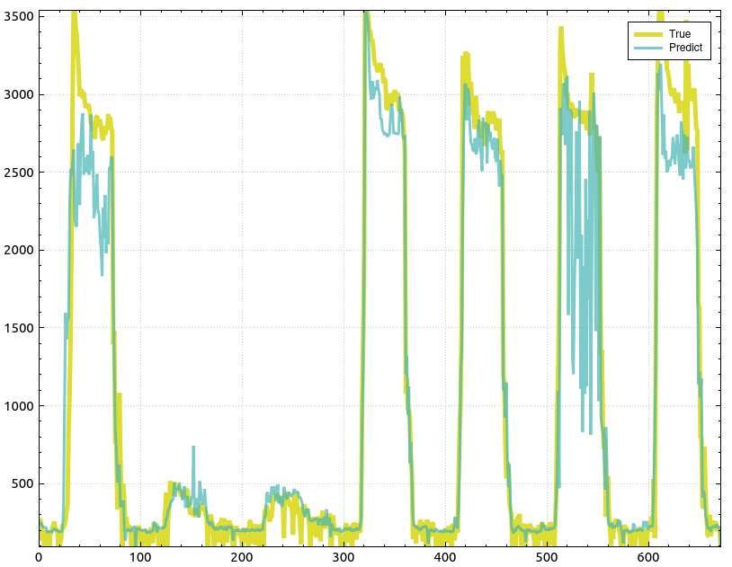

# DA-RNN
A C/C++ Pytorch implementation of DARNN

An implementation of "[A Dual-Stage Attention-Based Recurrent Neural Network for Time Series Prediction.](https://github.com/fanyun-sun/DARNN)"

Example of DARNN prediction over a 7-days time-series.

 
